# @l plan Feature - Complete Technical Documentation

## Table of Contents

1. [Introduction](#introduction)
2. [Architecture Overview](#architecture-overview)
3. [Complete Workflow](#complete-workflow)
4. [Core Components](#core-components)
5. [Implementation Details](#implementation-details)
6. [Configuration](#configuration)
7. [API Reference](#api-reference)
8. [Code Examples](#code-examples)
9. [Best Practices](#best-practices)
10. [Troubleshooting](#troubleshooting)
11. [Advanced Usage](#advanced-usage)
12. [Security Considerations](#security-considerations)

---

## Introduction

The `@l plan` feature is an AI-powered project planning system that transforms high-level user requests into actionable GitHub milestones and issues. It leverages GPT-4 to analyze repositories and generate comprehensive development plans with realistic timelines, priorities, and implementation guidance.

### Key Features

- 🤖 **AI-Powered Analysis**: Uses GPT-4 for intelligent repository analysis
- 📋 **Comprehensive Planning**: Generates categorized tasks with MoSCoW prioritization
- 🎯 **User-Centric**: Prioritizes user-specific requests while maintaining broad coverage
- 🔄 **Iterative Workflow**: Supports refinement and approval cycles
- 📊 **Professional Estimation**: T-shirt sizing with realistic hour estimates
- 🚀 **Automated Execution**: Seamless integration with GitHub Issues and Milestones

### Use Cases

1. **Project Kickoff**: Generate initial development roadmap
2. **Feature Planning**: Break down complex features into tasks
3. **Technical Debt**: Identify and prioritize improvements
4. **Security Audits**: Discover critical fixes needed
5. **Innovation Planning**: Explore new feature possibilities

---

## Architecture Overview

### Diagram Legend

```mermaid
flowchart LR
    subgraph Legend["🎨 Visual Guide"]
        A[🔵 User Interface]
        B[🟣 Processing Logic]
        C[🟢 External Services]
        D[🟠 Data Storage]
        E[🤖 AI Operations]
        F[⚙️ System Processes]
    end
    
    classDef userInterface fill:#e3f2fd,stroke:#1976d2,stroke-width:2px,color:#000
    classDef processing fill:#f3e5f5,stroke:#7b1fa2,stroke-width:2px,color:#000
    classDef external fill:#e8f5e8,stroke:#388e3c,stroke-width:2px,color:#000
    classDef storage fill:#fff3e0,stroke:#f57c00,stroke-width:2px,color:#000
    classDef aiProcess fill:#e0f2f1,stroke:#009688,stroke-width:2px,color:#000
    classDef systemProcess fill:#fce4ec,stroke:#c2185b,stroke-width:2px,color:#000
    
    class A userInterface
    class B processing
    class C external
    class D storage
    class E aiProcess
    class F systemProcess
```



### System Architecture Diagram

```mermaid
graph TB
    subgraph UI ["🖥️ User Interface"]
        A[💬 GitHub Issue Comment]
        B[⚙️ Command Parser]
    end
    
    subgraph PROCESSING ["🔄 Task Processing"]
        C[🎯 Task Router]
        D[📋 Plan Implementation]
        E[✅ Plan Approval]
        F[🚀 Plan Execution]
    end
    
    subgraph EXTERNAL ["🌐 External Services"]
        G[🐙 GitHub API]
        H[🤖 OpenAI API]
        I[⚡ Trigger.dev]
    end
    
    subgraph STORAGE ["💾 Data Storage"]
        J[📌 GitHub Milestones]
        K[🎫 GitHub Issues]
        L[🔒 Rate Limit Cache]
    end
    
    A --> B
    B --> C
    C --> D
    C --> E
    C --> F
    D --> G
    D --> H
    D --> J
    E --> G
    E --> H
    E --> K
    F --> G
    F --> K
    D --> L
    E --> L
    
    %% Enhanced styling for better visual hierarchy
    classDef userInterface fill:#e3f2fd,stroke:#1976d2,stroke-width:2px,color:#000
    classDef processing fill:#f3e5f5,stroke:#7b1fa2,stroke-width:2px,color:#000
    classDef external fill:#e8f5e8,stroke:#388e3c,stroke-width:2px,color:#000
    classDef storage fill:#fff3e0,stroke:#f57c00,stroke-width:2px,color:#000
    classDef subgraphStyle fill:#fafafa,stroke:#424242,stroke-width:2px
    
    class A,B userInterface
    class C,D,E,F processing
    class G,H,I external
    class J,K,L storage
```



### Component Interaction Diagram

```mermaid
sequenceDiagram
    participant U as 👤 User
    participant P as ⚙️ Parser
    participant R as 🎯 Router
    participant PT as 📋 PlanTask
    participant GH as 🐙 GitHub
    participant AI as 🤖 OpenAI
    participant AT as ✅ ApprovalTask
    
    Note over U,AT: 🚀 Plan Creation Phase
    U->>+P: @l plan add authentication
    P->>+R: ParsedCommand{command: "plan", userQuery: "add authentication"}
    R->>+PT: Execute plan-task
    PT->>GH: 📝 Post acknowledgment
    PT->>GH: 📊 Ingest repository
    PT->>+AI: 🔍 Analyze with context
    AI-->>-PT: 📈 Analysis results
    PT->>GH: 📌 Create milestone
    PT-->>-U: 🎉 Milestone created notification
    
    Note over U,AT: ✅ Plan Approval Phase
    U->>+P: @l approve
    P->>+R: ParsedCommand{command: "approve"}
    R->>+AT: Execute plan-approval-task
    AT->>GH: 🔍 Find milestone
    AT->>+AI: ✨ Enhance issues
    AI-->>-AT: 🎯 Enhanced descriptions
    AT->>GH: 🎫 Create issues
    AT-->>-U: ❓ Confirmation request
    
    %% Enhanced styling for better readability
    Note over U,AT: 📊 Process Complete - Ready for Development
```



---

## Complete Workflow

### Phase 1: Plan Creation

```mermaid
flowchart LR
    A[👤 User Input] --> B{⚙️ Parse Command}
    B --> C[🔍 Extract User Query]
    C --> D[🛡️ Rate Limit Check]
    D --> E[📢 Post Acknowledgment]
    E --> F[📊 Repository Ingestion]
    F --> G[🤖 AI Analysis]
    G --> H[📌 Create Milestone]
    H --> I[🎉 Notify User]
    
    %% Enhanced styling for workflow clarity
    classDef userAction fill:#e3f2fd,stroke:#1976d2,stroke-width:2px,color:#000
    classDef systemProcess fill:#f3e5f5,stroke:#7b1fa2,stroke-width:2px,color:#000
    classDef aiProcess fill:#e8f5e8,stroke:#388e3c,stroke-width:2px,color:#000
    classDef output fill:#fff3e0,stroke:#f57c00,stroke-width:2px,color:#000
    classDef check fill:#ffebee,stroke:#d32f2f,stroke-width:2px,color:#000
    
    class A userAction
    class B,C,E,F check
    class G aiProcess
    class H,I output
    class D systemProcess
```



#### Step 1: Command Parsing

```typescript
// Command format examples
@l plan                                    // General analysis
@l plan add user authentication           // Specific feature
@l planning implement REST API            // Alternative syntax
@l analyze improve database performance   // Another variant
```

**Code Reference**: [`src/lib/command-parser.ts`](src/lib/command-parser.ts)

```typescript
export function parseCommand(comment: string): ParsedCommand {
  // Sanitization and validation
  const sanitizedComment = sanitizeText(comment);
  
  // Extract command and user query
  const planCommandMatch = textAfterMention.match(/^(plan|planning|analyze)\s+(.+)$/i);
  if (planCommandMatch) {
    userQuery = planCommandMatch[2].trim();
  }
  
  return {
    command: textAfterMention.trim().toLowerCase(),
    fullText: textAfterMention,
    isMention: true,
    userQuery
  };
}
```

#### Step 2: Repository Analysis

**Code Reference**: [`src/trigger/plan-implementation.ts`](src/trigger/plan-implementation.ts)

```typescript
async function ingestRepository(octokit: Octokit, owner: string, repo: string): Promise<string> {
  // Parallel API calls for efficiency
  const [repoData, languages, commits] = await Promise.all([
    octokit.repos.get({ owner, repo }),
    octokit.repos.listLanguages({ owner, repo }),
    octokit.repos.listCommits({ owner, repo, per_page: 10 })
  ]);
  
  // Get repository tree (limited to MAX_REPO_ANALYSIS_FILES)
  const { data: tree } = await octokit.git.getTree({
    owner,
    repo,
    tree_sha: defaultBranchData.commit.sha,
    recursive: 'true'
  });
  
  // Extract key files in batches
  const keyFiles = ['README.md', 'package.json', 'requirements.txt', ...];
  // Process in batches of 3 to respect rate limits
}
```

#### Step 3: AI-Powered Analysis

**System Prompt Structure**:

```typescript
const systemPrompt = `You are a seasoned Engineering Manager with 15+ years experience...

🎯 MANAGEMENT FRAMEWORK:
- Apply MoSCoW method (Must/Should/Could/Won't)
- Use T-shirt sizing (XS/S/M/L/XL) with hour ranges
- Consider dependencies, blockers, and risks
- Evaluate technical debt impact
- Assess market timing and competitive positioning

📊 REALISTIC ESTIMATION GUIDELINES:
- XS (1-3 hours): Simple config changes
- S (4-8 hours): Small features
- M (1-3 days): Medium features
- L (1-2 weeks): Complex features
- XL (3+ weeks): Platform rewrites

Return analysis as structured JSON...`;
```

### Phase 2: Plan Approval


#### Issue Enhancement Process

```typescript
async function enhanceIssueBody(issue: IssueTemplate, repositoryContext: string): Promise<string> {
  const systemPrompt = `Transform basic issue into professional GitHub issue with:
    1. Clear Problem Statement
    2. Technical Context
    3. Implementation Steps
    4. Technical Specifications
    5. Acceptance Criteria
    6. Testing Requirements
    7. Documentation Needs
    8. Potential Challenges
    9. Resources & References`;
    
  // Call GPT-4o-mini for enhancement
  const enhancedContent = await callOpenAI(systemPrompt, issueDetails);
  return enhancedContent;
}
```

---

## Core Components

### 1. Command Parser (`src/lib/command-parser.ts`)

**Purpose**: Validates and routes user commands

**Key Functions**:
- `parseCommand()`: Extracts command and user query
- `getTaskType()`: Determines task routing
- `sanitizeText()`: Prevents XSS/injection attacks

**Command Recognition Patterns**:

```typescript
// Plan commands
const planPatterns = ['plan', 'planning', 'analyze'];

// Approval commands
const approvalPatterns = ['y', 'yes', 'ok', 'okay', 'approve', 'i approve'];

// Refinement commands (partial implementation)
const refinementPatterns = ['refine', 'revise', 'modify', 'update', 'change', 'edit'];

// Cancellation commands (partial implementation)
const cancellationPatterns = ['cancel', 'reject', 'no', 'abort', 'stop'];
```

### 2. Plan Implementation (`src/trigger/plan-implementation.ts`)

**Purpose**: Orchestrates repository analysis and milestone creation

**Key Functions**:
- `runPlanTask()`: Main entry point
- `ingestRepository()`: Gathers repository data
- `performComprehensiveAnalysis()`: AI analysis
- `createProjectMilestone()`: GitHub milestone creation

**Configuration Constants**:

```typescript
const MAX_REPO_ANALYSIS_FILES = 1000;
const MAX_CONTENT_LENGTH = 8000;
const OPENAI_TIMEOUT_MS = 120000; // 2 minutes
const RETRY_ATTEMPTS = 3;
const RETRY_DELAY_MS = 1000;
```

### 3. Plan Approval (`src/trigger/plan-approval-implementation.ts`)

**Purpose**: Converts milestones into actionable issues

**Key Functions**:
- `runPlanApprovalTask()`: Main entry point
- `findMostRecentMilestone()`: Locates milestone from comments
- `enhanceIssueDetails()`: AI-powered issue enhancement
- `createGitHubIssues()`: Batch issue creation
- `verifyMilestoneAttachments()`: Ensures proper linking

### 4. Issue Templates (`src/templates/issue-templates.ts`)

**Purpose**: Provides consistent formatting for user communications

**Key Templates**:
- `INITIAL_REPLY_TEMPLATE`: Acknowledgment message
- `MILESTONE_CREATED_TEMPLATE`: Success notification
- `CRITICAL_ISSUE_TEMPLATE`: High-priority issue format
- `COMPLETION_COMMENT_TEMPLATE`: Summary message

---

## Implementation Details

### Rate Limiting Strategy

```typescript
// Repository-level rate limiting
const rateLimitKey = `plan-creation-${owner}-${repo}`;
if (!checkRateLimit(rateLimitKey, 5)) { // 5 plans/minute/repo
  throw new Error("Rate limit exceeded");
}

// API call batching
const BATCH_SIZE = 3;
const BATCH_DELAY_MS = 2000;
for (let i = 0; i < items.length; i += BATCH_SIZE) {
  const batch = items.slice(i, i + BATCH_SIZE);
  await processBatch(batch);
  if (i + BATCH_SIZE < items.length) {
    await delay(BATCH_DELAY_MS);
  }
}
```

### Error Handling Pattern

```typescript
async function retryWithBackoff<T>(
  operation: () => Promise<T>,
  maxAttempts: number,
  baseDelay: number,
  context: string
): Promise<T> {
  let lastError: Error | undefined;
  
  for (let attempt = 1; attempt <= maxAttempts; attempt++) {
    try {
      return await operation();
    } catch (error) {
      lastError = error instanceof Error ? error : new Error('Unknown error');
      
      if (attempt === maxAttempts) {
        logger.error(`${context} failed after ${maxAttempts} attempts`);
        throw lastError;
      }
      
      const delay = baseDelay * Math.pow(2, attempt - 1); // Exponential backoff
      await new Promise(resolve => setTimeout(resolve, delay));
    }
  }
  
  throw lastError;
}
```

### Milestone Uniqueness Solution

```typescript
// Generate unique milestone title to prevent duplicates
const timestamp = currentDate.toISOString().replace(/:/g, '-').replace(/\./g, '-');
const randomSuffix = Math.random().toString(36).substr(2, 4);
const uniqueTitle = `AI Development Plan - ${timestamp}-${randomSuffix}`;
```

---

## Configuration

### Environment Variables

```bash
# Required
OPENAI_API_KEY=sk-...                    # OpenAI API key
GITHUB_APP_ID=123456                     # GitHub App ID
GITHUB_PRIVATE_KEY="-----BEGIN RSA..."   # GitHub App private key

# Optional with defaults
PLAN_MAX_ISSUES=20                       # Maximum issues per plan
PLAN_MAX_CONTENT_LENGTH=8000            # Max content for AI analysis
MAX_REPO_ANALYSIS_FILES=1000            # Max files to analyze
OPENAI_TIMEOUT_MS=120000                # OpenAI API timeout
RETRY_ATTEMPTS=3                        # API retry attempts
RETRY_DELAY_MS=1000                     # Initial retry delay
```

### Issue Labels Configuration

```typescript
export const ISSUE_LABELS = {
  CRITICAL: 'critical',           // Security/performance issues
  BUG: 'bug',                    // Defects
  SECURITY: 'security',          // Security vulnerabilities
  ENHANCEMENT: 'enhancement',    // Improvements
  MISSING_FEATURE: 'missing-feature',  // Required components
  IMPROVEMENT: 'improvement',    // Code quality
  TECHNICAL_DEBT: 'technical-debt',   // Refactoring needs
  FEATURE: 'feature',           // New capabilities
  INNOVATION: 'innovation'      // Future ideas
};
```

### Priority Mapping

```typescript
export const ISSUE_PRIORITIES = {
  CRITICAL: 'critical',  // Must fix immediately
  HIGH: 'high',         // Should address soon
  NORMAL: 'normal',     // Could improve
  FEATURE: 'feature'    // Won't affect current functionality
};
```

---

## API Reference

### Command Interface

```typescript
interface ParsedCommand {
  command: string;      // Normalized command text
  fullText: string;     // Original text after mention
  isMention: boolean;   // Valid @l mention detected
  userQuery?: string;   // Extracted user-specific query
}
```

### Analysis Response Structure

```typescript
interface PlanAnalysis {
  repositoryOverview: string;        // Executive summary
  missingComponents: string[];       // Required features
  criticalFixes: string[];          // Urgent issues
  requiredImprovements: string[];   // Technical debt
  innovationIdeas: string[];        // Future features
}
```

### Issue Template Structure

```typescript
interface IssueTemplate {
  title: string;                    // Issue title (max 256 chars)
  body: string;                     // Detailed description
  labels: string[];                 // GitHub labels
  priority: 'critical' | 'high' | 'normal' | 'feature';
}
```

---

## Code Examples

### Basic Usage

```bash
# Create a general development plan
@l plan

# Plan with specific focus
@l plan implement user authentication with OAuth2

# Approve the created plan
@l approve

# Refine the plan (partial implementation)
@l refine focus more on security aspects

# Cancel the plan (partial implementation)
@l cancel
```

### Advanced Usage

```bash
# Complex feature request
@l plan create a comprehensive CI/CD pipeline with automated testing, 
security scanning, and deployment to multiple environments

# Business-focused planning
@l plan improve application performance to handle 10x current traffic

# Technical debt focus
@l plan refactor the codebase to improve maintainability and test coverage
```

### Programmatic Integration

```typescript
// Custom task that triggers planning
async function createAutomatedPlan(context: GitHubContext) {
  const planPayload = {
    ...context,
    message: 'plan analyze repository for security vulnerabilities'
  };
  
  await runPlanTask(planPayload, ctx);
}

// React to plan creation
async function onMilestoneCreated(milestone: GitHubMilestone) {
  if (milestone.title.includes('AI Development Plan')) {
    // Custom logic for plan created
    await notifyTeam(milestone);
    await scheduleReview(milestone);
  }
}
```

---

## Best Practices

### For Users

1. **Provide Clear Context**
   ```bash
   ✅ Good: @l plan implement OAuth2 authentication with JWT tokens and refresh mechanism
   ❌ Poor: @l plan add login
   ```

2. **Review Before Approval**
   - Click the milestone link
   - Review all proposed tasks
   - Check time estimates
   - Verify priority assignments

3. **Use Iterative Refinement**
   ```bash
   @l plan create API
   # Review milestone
   @l refine add GraphQL support and rate limiting
   # Review updated plan
   @l approve
   ```

### For Repository Maintainers

1. **Optimize Repository Structure**
   ```
   project/
   ├── README.md          # Clear project description
   ├── package.json       # Dependencies and scripts
   ├── src/              # Organized source code
   ├── docs/             # Documentation
   └── tests/            # Test coverage
   ```

2. **Maintain Descriptive Files**
   ```json
   // package.json
   {
     "name": "my-project",
     "description": "Clear description of what this does",
     "keywords": ["relevant", "searchable", "terms"],
     "scripts": {
       "test": "jest",
       "build": "webpack",
       "start": "node server.js"
     }
   }
   ```

3. **Use Meaningful Commit Messages**
   ```bash
   git commit -m "feat: add user authentication with JWT"
   git commit -m "fix: resolve memory leak in data processing"
   git commit -m "docs: update API documentation"
   ```

### For System Administrators

1. **Monitor Performance**
   ```typescript
   // Add custom metrics
   logger.info("Plan analysis completed", {
     duration: Date.now() - startTime,
     filesAnalyzed: fileCount,
     issuesGenerated: issues.length
   });
   ```

2. **Configure Appropriate Limits**
   ```bash
   # Adjust based on repository size and complexity
   PLAN_MAX_ISSUES=30              # For large projects
   MAX_REPO_ANALYSIS_FILES=2000    # For monorepos
   OPENAI_TIMEOUT_MS=180000        # For complex analysis
   ```

3. **Implement Monitoring**
   ```typescript
   // Track success rates
   const metrics = {
     plansCreated: 0,
     plansApproved: 0,
     issuesCreated: 0,
     apiFailures: 0,
     averageAnalysisTime: 0
   };
   ```

---

## Troubleshooting

### Common Issues and Solutions

#### 1. "Rate limit exceeded" Error

**Symptoms**: Task fails with rate limit message

**Solutions**:
- Wait 60 seconds before retrying
- Reduce `PLAN_MAX_ISSUES` setting
- Increase `BATCH_DELAY_MS` for API calls

```typescript
// Temporary override for testing
const testConfig = {
  maxIssues: 5,
  retryDelay: 3000,
  batchSize: 1
};
```

#### 2. Milestone Creation Fails

**Symptoms**: "already_exists" validation error

**Solutions**:
- System now uses unique timestamps
- Check for existing milestones:

```bash
# List recent milestones
gh api /repos/OWNER/REPO/milestones --jq '.[].title'
```

#### 3. Issues Not Attached to Milestone

**Symptoms**: Issues created but not linked

**Solutions**:
- System includes automatic retry
- Manual fix via API:

```typescript
await octokit.issues.update({
  owner,
  repo,
  issue_number: issueNumber,
  milestone: milestoneNumber
});
```

#### 4. AI Analysis Timeout

**Symptoms**: OpenAI API timeout errors

**Solutions**:
- Increase `OPENAI_TIMEOUT_MS`
- Reduce repository content size
- Use fallback analysis

```typescript
// Force fallback for testing
const USE_FALLBACK_ANALYSIS = true;
```

### Debug Mode

Enable detailed logging:

```typescript
// Set in environment
LOG_LEVEL=debug

// Or in code
logger.setLevel('debug');

// Custom debug logging
logger.debug("Repository analysis", {
  fileCount: tree.tree.length,
  keyFiles: Object.keys(fileContents),
  contentLength: repoSummary.length
});
```

---

## Advanced Usage

### Custom Analysis Prompts

```typescript
// Override system prompt for specialized analysis
const customSystemPrompt = `
You are a security expert analyzing for vulnerabilities.
Focus on:
- Authentication weaknesses
- Input validation gaps
- Dependency vulnerabilities
- Data exposure risks
${baseSystemPrompt}
`;
```

### Webhook Integration

```typescript
// React to plan events
app.post('/webhook/plan-created', async (req, res) => {
  const { milestone, repository } = req.body;
  
  // Custom notifications
  await slack.send({
    text: `New plan created: ${milestone.title}`,
    attachments: [{
      title: 'Review and Approve',
      title_link: milestone.html_url,
      color: 'good'
    }]
  });
});
```

### Automated Workflows

```typescript
// Schedule regular planning
async function weeklyPlanning() {
  const repos = await getActiveRepositories();
  
  for (const repo of repos) {
    await createPlan(repo, 'plan weekly improvement analysis');
    await wait(60000); // Respect rate limits
  }
}

// Conditional approval
async function autoApprove(milestone: GitHubMilestone) {
  const issues = parseIssuesFromMilestone(milestone);
  const totalEffort = calculateTotalEffort(issues);
  
  if (totalEffort <= 40) { // 40 hours or less
    await approvePlan(milestone);
  } else {
    await requestManualReview(milestone);
  }
}
```

### Custom Issue Categorization

```typescript
// Extend issue categorization
const CUSTOM_CATEGORIES = {
  PERFORMANCE: {
    keywords: ['slow', 'performance', 'optimize', 'cache'],
    label: 'performance',
    template: PERFORMANCE_ISSUE_TEMPLATE
  },
  ACCESSIBILITY: {
    keywords: ['a11y', 'accessibility', 'screen reader'],
    label: 'accessibility', 
    template: A11Y_ISSUE_TEMPLATE
  }
};

// Apply custom categorization
function categorizeIssue(description: string): string[] {
  const labels = [];
  for (const [category, config] of Object.entries(CUSTOM_CATEGORIES)) {
    if (config.keywords.some(keyword => 
      description.toLowerCase().includes(keyword)
    )) {
      labels.push(config.label);
    }
  }
  return labels;
}
```

---

## Security Considerations

### Input Validation

```typescript
// Command sanitization
function sanitizeText(text: string): string {
  // Remove HTML tags
  let sanitized = text.replace(/<[^>]*>/g, '');
  
  // Remove markdown links but keep text
  sanitized = sanitized.replace(/\[([^\]]+)\]\([^)]+\)/g, '$1');
  
  // Remove potential script injection
  sanitized = sanitized.replace(/javascript:/gi, '');
  sanitized = sanitized.replace(/on\w+\s*=/gi, '');
  
  return sanitized.trim();
}

// Length validation
if (sanitizedComment.length > 10000) {
  console.warn('Comment too long, truncating');
  return parseCommand(sanitizedComment.slice(0, 10000));
}
```

### API Key Security

```typescript
// Never log API keys
const openaiApiKey = process.env.OPENAI_API_KEY;
if (!openaiApiKey) {
  logger.error("OpenAI API key not found"); // Don't log the key
  throw new Error("Configuration error");
}

// Validate GitHub webhook signatures
function verifyWebhookSignature(payload: string, signature: string): boolean {
  const secret = process.env.GITHUB_WEBHOOK_SECRET;
  const computed = `sha256=${crypto
    .createHmac('sha256', secret)
    .update(payload)
    .digest('hex')}`;
  return crypto.timingSafeEqual(
    Buffer.from(signature),
    Buffer.from(computed)
  );
}
```

### Rate Limiting Protection

```typescript
// Implement per-user rate limiting
const userRateLimits = new Map<string, number[]>();

function checkUserRateLimit(userId: string, limit: number = 10): boolean {
  const now = Date.now();
  const window = 3600000; // 1 hour
  
  const timestamps = userRateLimits.get(userId) || [];
  const recentRequests = timestamps.filter(t => now - t < window);
  
  if (recentRequests.length >= limit) {
    return false;
  }
  
  recentRequests.push(now);
  userRateLimits.set(userId, recentRequests);
  return true;
}
```

### Data Privacy

```typescript
// Redact sensitive information in logs
function redactSensitive(obj: any): any {
  const sensitiveKeys = ['token', 'key', 'secret', 'password'];
  
  if (typeof obj !== 'object') return obj;
  
  const redacted = { ...obj };
  for (const key of Object.keys(redacted)) {
    if (sensitiveKeys.some(k => key.toLowerCase().includes(k))) {
      redacted[key] = '[REDACTED]';
    } else if (typeof redacted[key] === 'object') {
      redacted[key] = redactSensitive(redacted[key]);
    }
  }
  return redacted;
}

// Use in logging
logger.info("API call completed", redactSensitive({
  endpoint: '/repos/get',
  token: apiToken, // Will be redacted
  duration: 1234
}));
```

---

## Conclusion

The `@l plan` feature represents a sophisticated AI-powered planning system that transforms natural language requests into actionable development plans. By combining intelligent repository analysis, professional project management methodologies, and seamless GitHub integration, it significantly accelerates the planning phase of software development.

### Key Takeaways

1. **Comprehensive Analysis**: Leverages AI to provide thorough repository evaluation
2. **Professional Standards**: Applies industry-standard methodologies (MoSCoW, T-shirt sizing)
3. **User-Centric Design**: Prioritizes specific user needs while maintaining broad coverage
4. **Robust Architecture**: Built with error handling, rate limiting, and scalability in mind
5. **Extensible System**: Designed for customization and integration with existing workflows

### Future Enhancements

- Full implementation of refinement workflows
- Multi-language support for global teams
- Integration with project management tools
- Advanced analytics and reporting
- Machine learning for estimation improvement

For the latest updates and contributions, visit the [GitHub repository](https://github.com/your-org/your-repo).