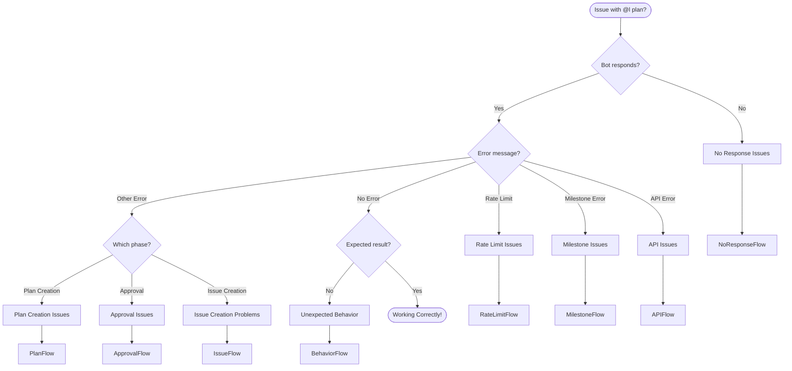
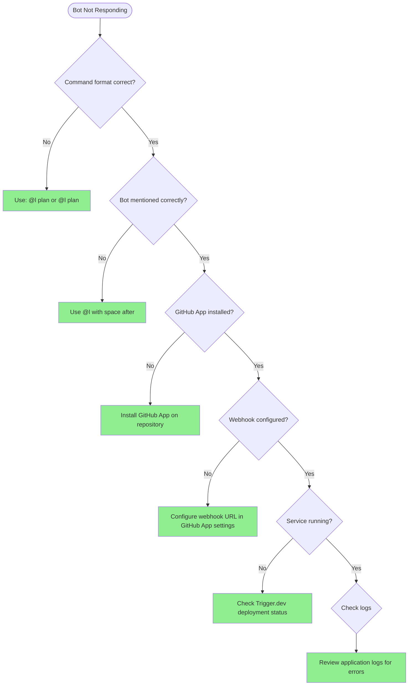
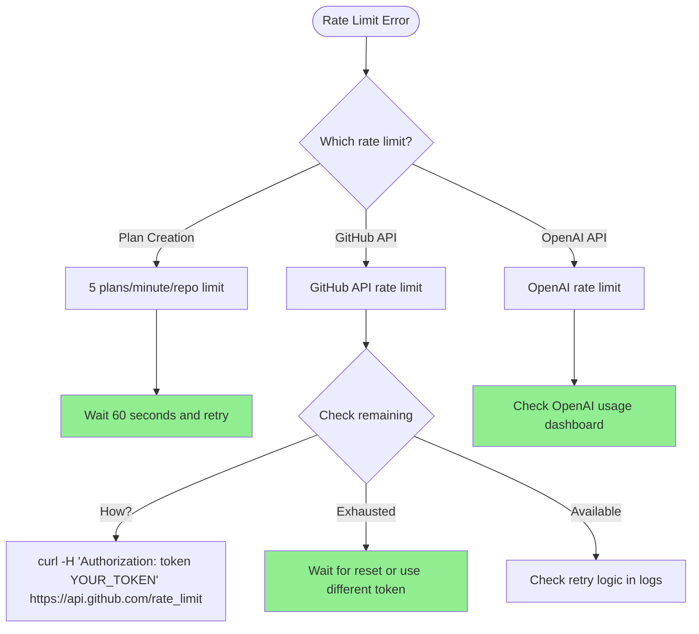
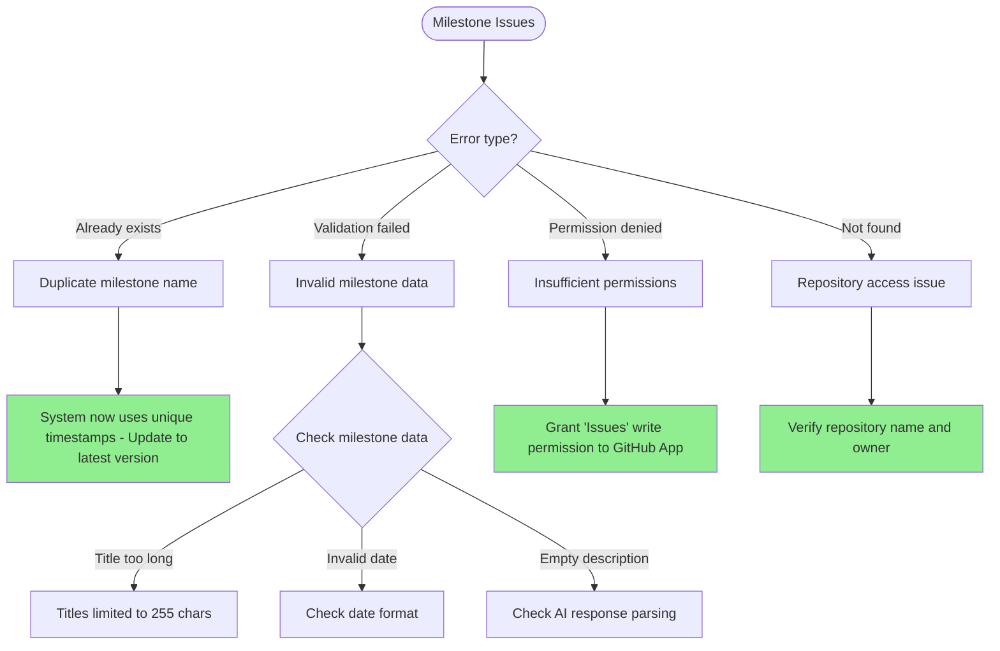
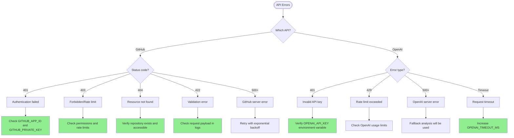
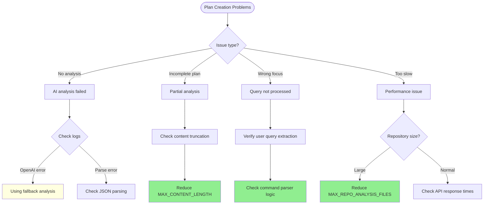
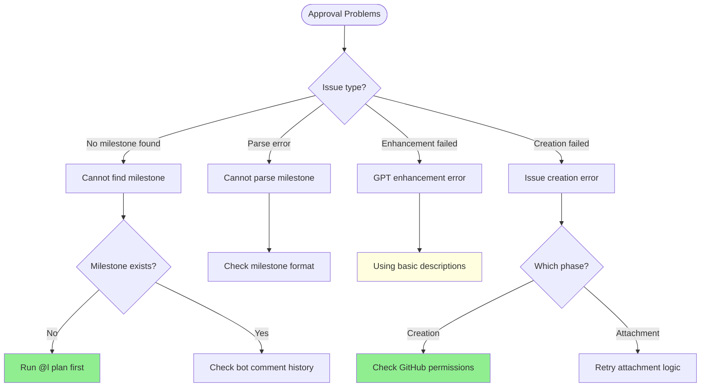
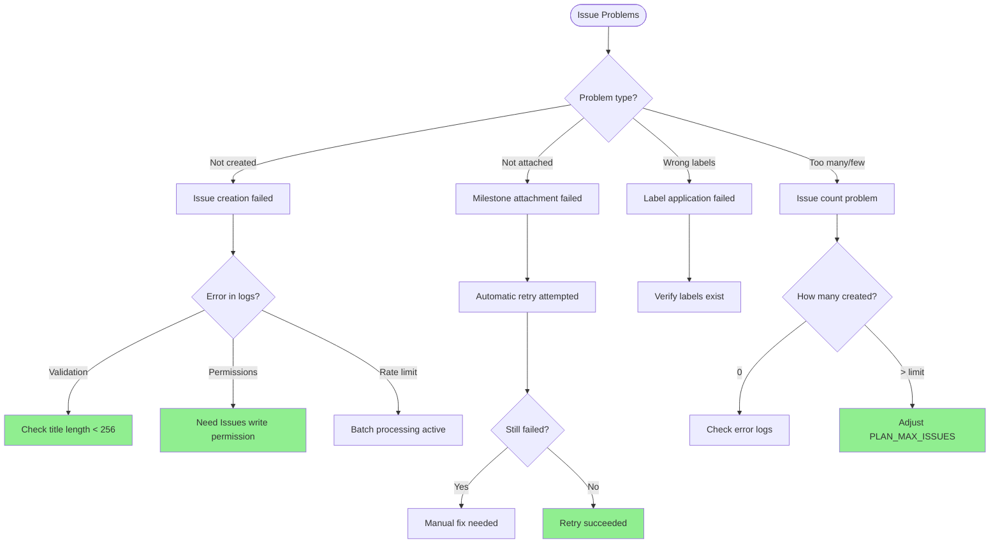
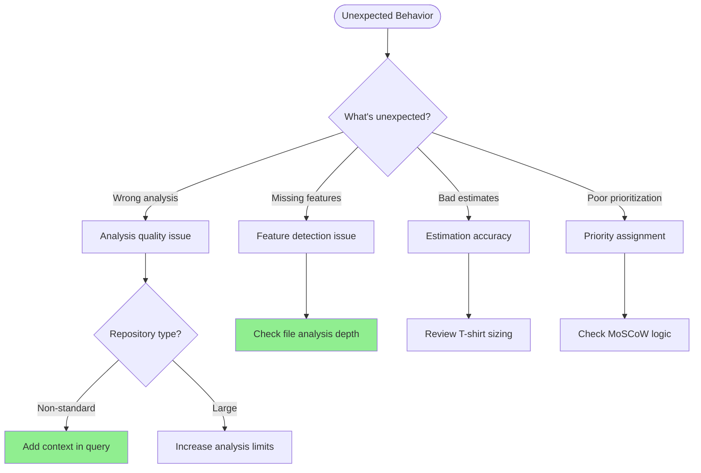

# @l plan Troubleshooting Flowchart Guide

This document provides visual troubleshooting flowcharts to help diagnose and resolve common issues with the `@l plan` feature.

## Main Troubleshooting Flowchart



## 1. No Response Issues



### Quick Fixes:
- ✅ Correct format: `@l plan` or `@l plan add authentication`
- ✅ Ensure space after `@l`
- ✅ Verify GitHub App is installed on the repository
- ✅ Check webhook delivery in GitHub settings

## 2. Rate Limit Issues



### Solutions:
```typescript
// Temporary override for testing
const config = {
  maxIssues: 5,           // Reduce from 20
  retryDelay: 3000,       // Increase from 1000
  batchSize: 1            // Reduce from 3
};

// Check rate limit status
const checkRateLimit = async (octokit) => {
  const { data } = await octokit.rateLimit.get();
  console.log('Remaining:', data.rate.remaining);
  console.log('Reset at:', new Date(data.rate.reset * 1000));
};
```

## 3. Milestone Creation Issues



### Debug Commands:
```bash
# List existing milestones
gh api /repos/OWNER/REPO/milestones --jq '.[].title'

# Check permissions
gh api /repos/OWNER/REPO/collaborators/APP_USERNAME/permission

# Manual milestone creation test
gh api /repos/OWNER/REPO/milestones \
  --method POST \
  --field title="Test Milestone $(date +%s)" \
  --field description="Test"
```

## 4. API Error Issues



### Environment Check:
```bash
# Verify environment variables
echo "GitHub App ID: ${GITHUB_APP_ID:+SET}"
echo "GitHub Private Key: ${GITHUB_PRIVATE_KEY:+SET}"
echo "OpenAI API Key: ${OPENAI_API_KEY:+SET}"

# Test OpenAI connection
curl https://api.openai.com/v1/models \
  -H "Authorization: Bearer $OPENAI_API_KEY" \
  --fail --silent --show-error
```

## 5. Plan Creation Issues



### Debugging Code:
```typescript
// Add debug logging
logger.info("User query extracted", { 
  userQuery: userQuery || 'none',
  originalMessage: payload.message 
});

// Test query extraction
const testQueries = [
  "@l plan add authentication",
  "@l planning implement API",
  "@l analyze improve performance"
];

testQueries.forEach(query => {
  const parsed = parseCommand(query);
  console.log(`Query: ${query}`);
  console.log(`Extracted: ${parsed.userQuery}`);
});
```

## 6. Approval Phase Issues



### Manual Verification:
```typescript
// Find milestone manually
const findMilestone = async (octokit, owner, repo) => {
  const { data: milestones } = await octokit.issues.listMilestones({
    owner,
    repo,
    state: 'open',
    sort: 'created',
    direction: 'desc',
    per_page: 5
  });
  
  return milestones.find(m => 
    m.title.includes('AI Development Plan')
  );
};
```

## 7. Issue Creation Problems



### Manual Fix for Attachments:
```typescript
// Fix milestone attachments manually
const fixAttachments = async (octokit, owner, repo, issueNumbers, milestoneNumber) => {
  for (const issueNumber of issueNumbers) {
    try {
      await octokit.issues.update({
        owner,
        repo,
        issue_number: issueNumber,
        milestone: milestoneNumber
      });
      console.log(`✅ Fixed issue #${issueNumber}`);
    } catch (error) {
      console.error(`❌ Failed to fix #${issueNumber}:`, error.message);
    }
  }
};
```

## 8. Unexpected Behavior



### Improvement Strategies:
```bash
# Provide more context
@l plan add authentication for React SPA with JWT tokens

# Focus on specific areas
@l plan analyze backend API performance issues

# Request specific prioritization
@l plan focus on security vulnerabilities and critical bugs
```

## Quick Reference Card

### Common Error Messages and Solutions

| Error Message | Likely Cause | Quick Fix |
|--------------|--------------|-----------|
| "Rate limit exceeded" | Too many requests | Wait 60 seconds |
| "No recent milestone found" | Haven't run `@l plan` | Run `@l plan` first |
| "already_exists" | Duplicate milestone | Update to latest version |
| "Bad credentials" | Invalid GitHub auth | Check APP_ID and PRIVATE_KEY |
| "Invalid API key" | OpenAI key issue | Verify OPENAI_API_KEY |
| "Timeout" | Slow API response | Increase timeout settings |
| "Validation failed" | Invalid data format | Check logs for details |

### Health Check Commands

```bash
# 1. Check bot is responding
echo "Test comment" | gh issue comment ISSUE_NUMBER --body-file -

# 2. Verify webhook delivery
# Go to: Settings > GitHub Apps > Your App > Advanced > Recent Deliveries

# 3. Check service logs
trigger.dev logs --task plan-task --limit 50

# 4. Test API connections
# GitHub
curl -H "Authorization: token YOUR_TOKEN" https://api.github.com/rate_limit

# OpenAI
curl https://api.openai.com/v1/models \
  -H "Authorization: Bearer $OPENAI_API_KEY"

# 5. Verify environment
env | grep -E "(GITHUB|OPENAI|PLAN_)" | sed 's/=.*/=***/'
```

### Emergency Fixes

```typescript
// Force fallback analysis (bypass OpenAI)
process.env.FORCE_FALLBACK_ANALYSIS = 'true';

// Reduce load for testing
process.env.PLAN_MAX_ISSUES = '5';
process.env.MAX_REPO_ANALYSIS_FILES = '100';

// Increase timeouts
process.env.OPENAI_TIMEOUT_MS = '180000'; // 3 minutes
process.env.RETRY_DELAY_MS = '5000'; // 5 seconds

// Disable enhancement (basic issues only)
process.env.SKIP_ISSUE_ENHANCEMENT = 'true';
```

## Escalation Path

If none of the above solutions work:

1. **Enable Debug Logging**
   ```typescript
   process.env.LOG_LEVEL = 'debug';
   ```

2. **Check Complete Logs**
   - Application logs
   - GitHub webhook logs
   - Trigger.dev execution logs

3. **Test Minimal Configuration**
   - Reduce all limits to minimum
   - Test with simple commands
   - Verify basic connectivity

4. **File an Issue**
   Include:
   - Exact command used
   - Error messages
   - Repository size/type
   - Recent logs
   - Environment configuration (redacted)

## Prevention Best Practices

1. **Monitor Rate Limits**
   - Set up alerts for approaching limits
   - Implement usage tracking
   - Plan for peak usage

2. **Regular Health Checks**
   - Weekly API connectivity tests
   - Monthly performance reviews
   - Quarterly configuration audits

3. **Graceful Degradation**
   - Fallback analysis ready
   - Reduced functionality modes
   - Clear error messaging

4. **Documentation**
   - Keep runbooks updated
   - Document custom configurations
   - Maintain troubleshooting log

---

*Last Updated: [Current Date]*
*Version: 1.0*